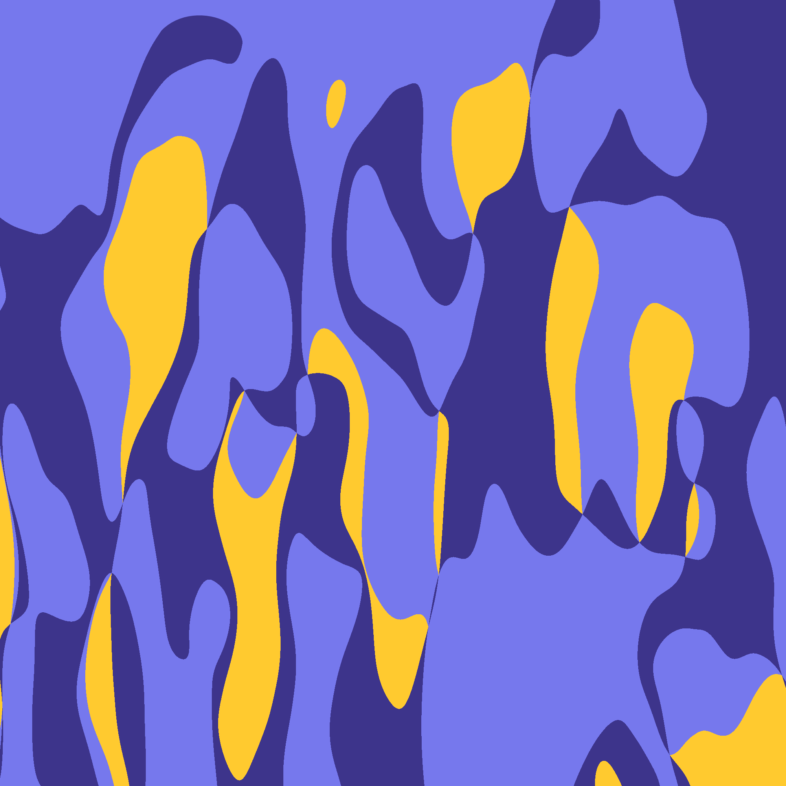
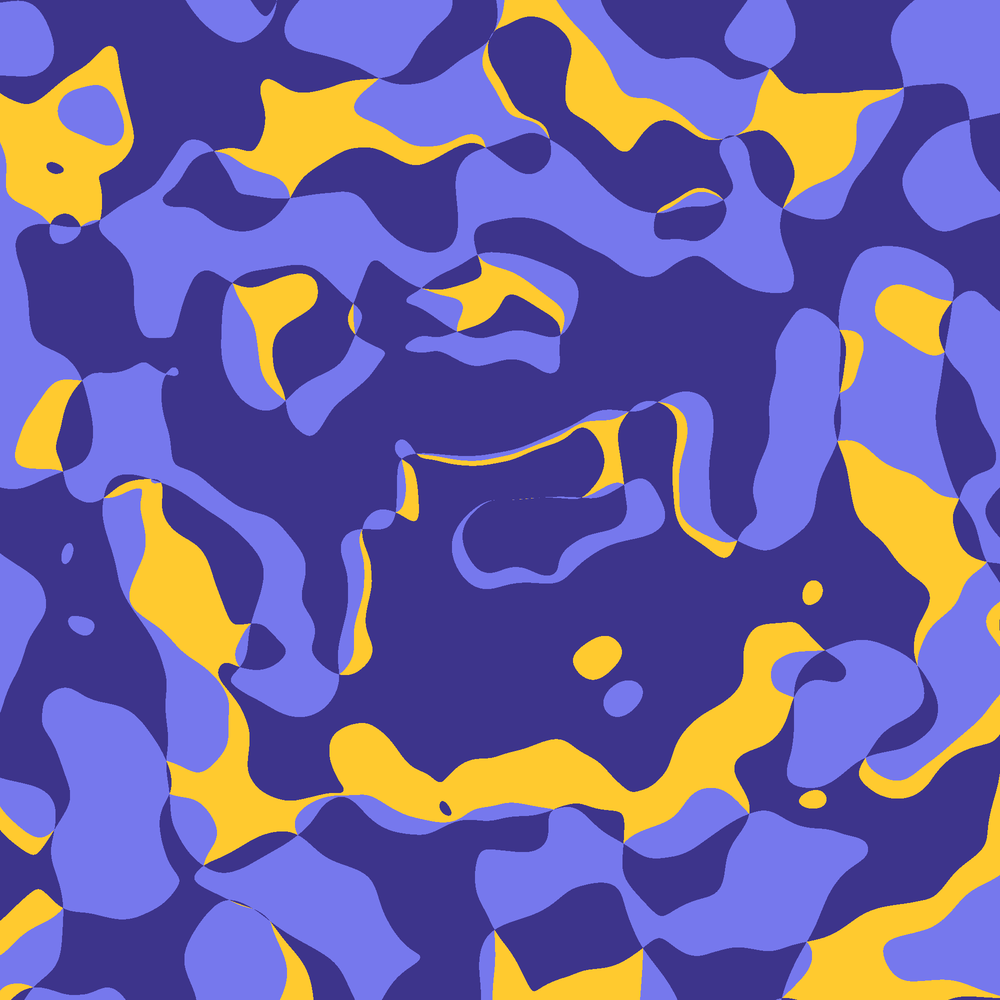

# 01 - Color Splashes

> For this one I tried to mix in a few noise fields to get blobby shapes. I ended up generating three fields and picking a color based on which field was the median one (aka neither the smallest nor the largest).

| | |
| --- | --- |
|  |  |
