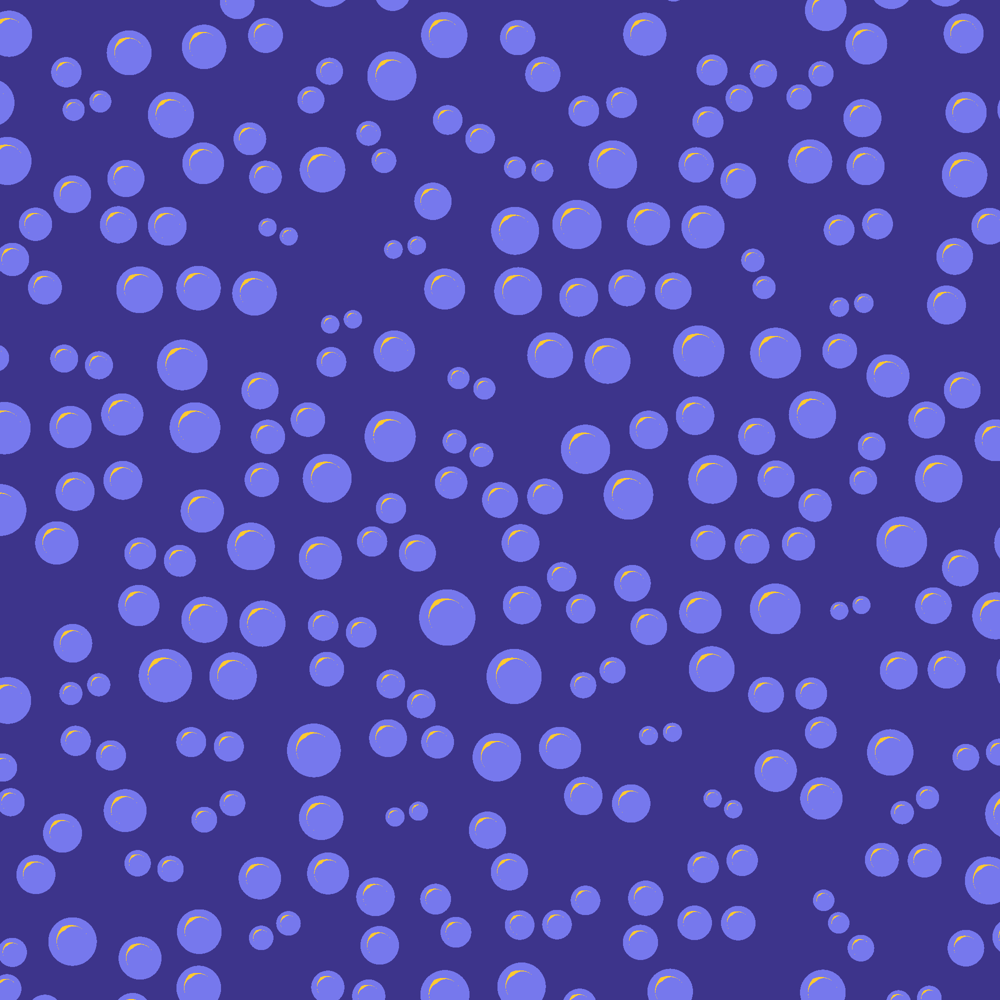

# 03 - Bubbles

> For this one I tried to mix in a few noise fields to get blobby shapes. I ended up generating three fields and picking a color based on which field was the median one (aka neither the smallest nor the largest).

| | |
| --- | --- |
|  |  |

https://user-images.githubusercontent.com/45451201/193414348-81e68d99-3932-4e60-8859-2d7a847f29a0.mp4
